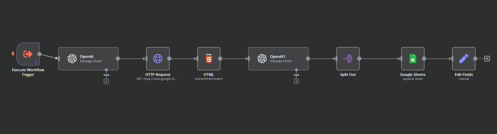
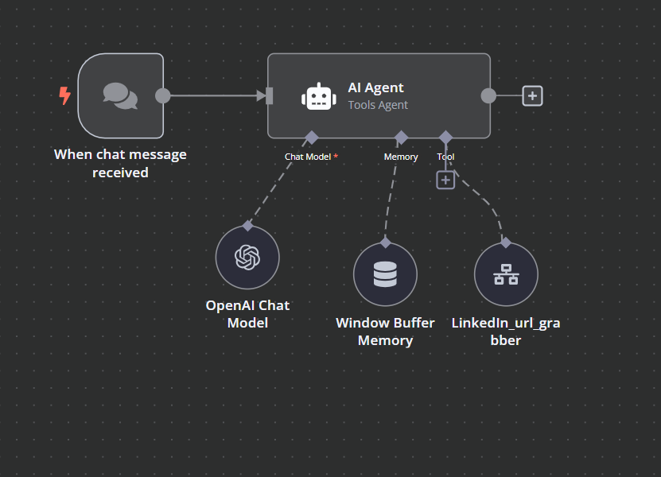

# n8n Workflow: LinkedIn Profile URL Extraction  

This repository contains an **n8n** workflow designed to automate the extraction of **LinkedIn profile URLs** using **advanced Google search queries**. The extracted URLs are then stored in a **Google Sheet**, ensuring efficient data collection and management.  

---

## 📌 Overview  

This workflow automates the process of searching for **LinkedIn profiles** based on specific keywords and saving the results in a structured format.  

### **🔹 Key Features:**  
✔ **Automated Google Search** – Uses advanced search operators to extract LinkedIn profile URLs.  
✔ **Data Extraction & Filtering** – Extracts valid LinkedIn profile links from search results.  
✔ **Google Sheets Integration** – Stores extracted URLs in a Google Sheet for easy access and management.  

---

## 🏗️ Workflow Structure  

### **1️⃣ Google Search Execution**  
- Uses **Google Custom Search API** or **Scraper API** (if applicable).  
- Executes queries using **Google Dorking techniques** to find LinkedIn profiles.  
- Example search query:  
  ```
  site:linkedin.com/in "Software Engineer" "San Francisco"
  ```

### **2️⃣ URL Extraction & Processing**  
- Parses search results to extract **LinkedIn profile URLs**.  
- Filters out invalid or duplicate entries.  

### **3️⃣ Google Sheets Integration**  
- Connects to a **Google Sheets document**.  
- Automatically appends extracted LinkedIn profile URLs to a designated sheet.  
- Ensures seamless data storage and retrieval.  

---

## 📌 Workflow Diagram  

**🔹 Workflow Image:**  
  
  

---

## 🚀 How to Use  

### **Step 1: Set Up n8n**  
If you haven't installed **n8n**, you can set it up using:  

#### **Using npx (Quick Run)**
```bash
npx n8n
```

#### **Using Docker**
```bash
docker run -it --rm -p 5678:5678 n8nio/n8n
```

### **Step 2: Import the Workflow**  
1. **Open n8n** in your browser at `http://localhost:5678`.  
2. Go to **"Import Workflow"** and upload the provided JSON file.  

### **Step 3: Configure API Keys**  
- **Google Custom Search API** – Add your API key in the workflow settings.  
- **Google Sheets Node** – Connect your Google Sheets account.  

### **Step 4: Run the Workflow**  
- Start the workflow and let it fetch **LinkedIn profile URLs** from Google search results.  
- The extracted links will be stored automatically in **Google Sheets**.  

---

## 🛠️ Customization  

- Modify the **search query parameters** to extract LinkedIn profiles based on specific roles, industries, or locations.  
- Adjust the **Google Sheets structure** to store additional metadata (e.g., name, job title).  

---

## 📜 License  
This repository is open-source. Feel free to modify and use the workflow for your data collection needs.  

---

## 🔗 Resources  
- 📖 **n8n Docs:** [https://docs.n8n.io](https://docs.n8n.io)  
- 🔍 **Google Custom Search API:** [https://developers.google.com/custom-search](https://developers.google.com/custom-search)  
- 📊 **Google Sheets API:** [https://developers.google.com/sheets/api](https://developers.google.com/sheets/api)  
- 💬 **Join the n8n Community:** [https://community.n8n.io](https://community.n8n.io)  
