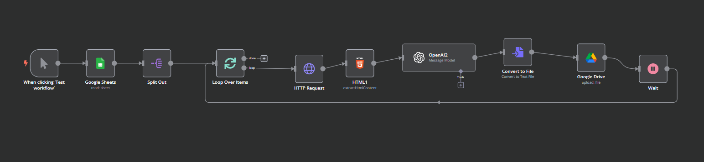
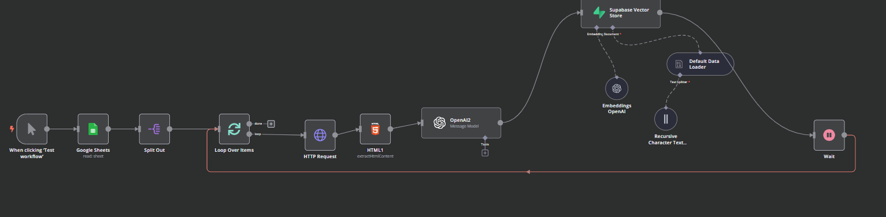

# n8n Workflows: LinkedIn Post Metadata Extraction  

This repository contains two **n8n workflows** designed to **automate LinkedIn post metadata extraction** based on URLs stored in a **Google Sheets document**. The extracted metadata is processed using **OpenAI’s language model** and saved in either:  

1. **Google Drive** as structured text files.  
2. **Supabase Vector Store** for advanced retrieval and semantic search.  

---

## 📌 Workflow 1: Save Metadata to Google Drive  

### **🔹 Overview**  
This workflow retrieves LinkedIn post URLs from **Google Sheets**, extracts metadata using **OpenAI's LLM**, and saves the metadata as `.txt` files in **Google Drive**.  

### **🔹 Workflow Steps**  
1️⃣ **Retrieve Input Data**  
- Fetch **LinkedIn post URLs** from a **Google Sheets document**.  

2️⃣ **Webpage Parsing**  
- Use **HTTP Request Node** to fetch the **HTML content** of each LinkedIn post.  
- Parse the HTML to extract **post content**.  

3️⃣ **Metadata Extraction via OpenAI**  
- Send parsed post content to **OpenAI LLM** for metadata extraction.  
- Extract the following fields:  
  - **Text:** Main post content  
  - **Author:** Name of the post’s author  
  - **Author Profile:** URL of the author's LinkedIn profile  
  - **Title:** Headline or title of the post  
  - **Comments:** Details of comments (name, profile, text, timestamp)  
  - **Likes:** Number of likes on the post  
  - **Shares:** Number of shares  
  - **Hashtags:** Used in the post content  
  - **Timestamped:** Post creation timestamp  
  - **Post URL:** URL of the LinkedIn post  
  - **Media Attachments:** Images, videos, documents with media type & URL  

4️⃣ **Save Metadata to Google Drive**  
- Convert extracted metadata into a **.txt file**.  
- Name the file based on the **LinkedIn post URL**.  
- Save the file in a **Google Drive folder** for further processing.  

---

## 📌 Workflow 2: Save Metadata to Supabase Vector Store  

### **🔹 Overview**  
This workflow follows the same steps as the first one but instead of storing metadata in Google Drive, it **embeds** and **stores** the data in a **Supabase Vector Store** for advanced search and retrieval.  

### **🔹 Workflow Steps**  
1️⃣ **Retrieve Input Data**  
- Fetch **LinkedIn post URLs** from **Google Sheets**.  

2️⃣ **Webpage Parsing**  
- Use **HTTP Request Node** to fetch LinkedIn post HTML content.  

3️⃣ **Metadata Extraction via OpenAI**  
- Extracts the same metadata fields as in **Workflow 1**.  

4️⃣ **Store in Supabase Vector Store**  
- Convert extracted metadata into **vector embeddings** using **OpenAI embeddings**.  
- Store the metadata in **Supabase** for **semantic search & retrieval**.  

---

## 📌 Workflow Diagrams  

**🔹 Google Drive Workflow:**  
  

**🔹 Supabase Vector Store Workflow:**  
  

---

## 🚀 How to Use  

### **Step 1: Set Up n8n**  
If you haven't installed **n8n**, you can set it up using:  

#### **Using npx (Quick Run)**
```bash
npx n8n
```

#### **Using Docker**
```bash
docker run -it --rm -p 5678:5678 n8nio/n8n
```

### **Step 2: Import the Workflow**  
1. **Open n8n** in your browser at `http://localhost:5678`.  
2. Go to **"Import Workflow"** and upload the provided JSON file.  

### **Step 3: Configure API Keys & Integrations**  
- **Google Sheets API** – Fetch LinkedIn post URLs.  
- **Google Drive API** (For Workflow 1) – Store `.txt` metadata files.  
- **Supabase API** (For Workflow 2) – Store metadata in vector format.  
- **OpenAI API** – Extract metadata & generate embeddings.  

### **Step 4: Run the Workflow**  
- Start the workflow and let it process **LinkedIn post URLs**.  
- Depending on the workflow:  
  - **Google Drive:** Metadata is stored as `.txt` files.  
  - **Supabase:** Metadata is embedded and stored in a vector database.  

---

## 📜 License  
This repository is open-source. Modify and use the workflows as needed.  

---

## 🔗 Resources  
- 📖 **n8n Docs:** [https://docs.n8n.io](https://docs.n8n.io)  
- 🔍 **Google Drive API:** [https://developers.google.com/drive](https://developers.google.com/drive)  
- 🏗️ **Supabase Docs:** [https://supabase.com/docs](https://supabase.com/docs)  
- 💬 **Join the n8n Community:** [https://community.n8n.io](https://community.n8n.io)  
